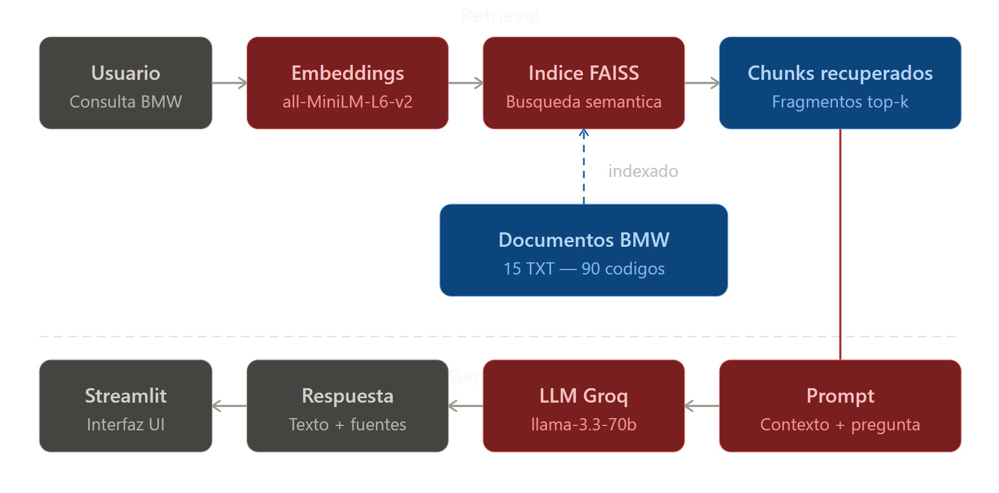

# BMW IA — Asistente de Codigos de Error

Sistema RAG (Retrieval-Augmented Generation) para consultar codigos de error OBD-II de vehiculos BMW. El sistema recupera informacion relevante de una base de conocimiento local y genera respuestas con evidencia y fuentes citadas.

---

## Video de demostración


---



]

---

## Estructura del proyecto

```
ia_rag/
├── data/                  # 15 archivos TXT con 90 codigos de error BMW
├── app.py                 # Interfaz Streamlit
├── rag_pipeline.py        # Logica de busqueda y generacion
├── ingest.py              # Carga, chunking e indexacion
├── evaluate.py            # Metricas y experimentos
├── golden_set.json        # 12 preguntas de prueba
├── evaluation_report.csv  # Reporte de metricas generado
└── README.md
```

---


## Stack tecnologico

| Componente | Tecnologia |
|-----------|------------|
| Embeddings | sentence-transformers (all-MiniLM-L6-v2) |
| Base vectorial | FAISS (local) |
| LLM | Groq API — llama-3.3-70b-versatile |
| Interfaz | Streamlit |
| Lenguaje | Python 3.11.9 |

---

## Dataset

- **15 documentos TXT** organizados por sistema del vehiculo
- **90 codigos de error** 

| Sistema | Documentos | Codigos |
|---------|-----------|---------|
| Motor   | 3           | 18 |
| Transmision | 2       | 12 |
| Frenos/ABS | 2        | 12 |
| Electrico/Bateria | 2 | 12 |
| Airbag/Carroceria | 2 | 12 |
| Emisiones | 2         | 12 |
| Direccion | 2         | 12 |
| **Total** | **15** | **90** |

---

## Metricas

Se evaluo el sistema usando un golden set de **12 preguntas de prueba** con las siguientes metricas:

- **Precision@k**: proporcion de fragmentos recuperados que provienen de la fuente esperada
- **Recall@k**: indica si al menos un fragmento de la fuente esperada fue recuperado en los primeros k resultados

### Resultados base (chunk=500, k=5)

| Metrica | Valor |
|---------|-------|
| Precision@5 | 0.2333 |
| Recall@5 | 0.5833 |
| Latencia promedio | 2.95s |

---

## Experimentos

### Experimento 1 — Tamano de chunk (k=5 fijo)

| Chunk Size | Fragmentos | Precision@5 | Recall@5 | Latencia |
|------------|-----------|-------------|----------|----------|
| 300 | 353 | 0.2333 | 0.5833 | 1.22s |
| 500 | 199 | 0.2333 | 0.5833 | 2.95s |
| 600 | 164 | 0.2000 | 0.5000 | 3.09s |

**Decision:** chunk_size=300 ofrece mejor recall con menor latencia. Configuracion final del sistema.

### Experimento 2 — Top-k (chunk=500 fijo)

| Top-k | Precision@k | Recall@k | Latencia |
|-------|-------------|----------|----------|
| k=3 | 0.2500 | 0.4167 | 1.79s |
| k=5 | 0.2333 | 0.5833 | 2.95s |
| k=7 | 0.2738 | 0.8333 | 3.25s |

**Decision:** k=5 ofrece el mejor balance entre recall y latencia.

---

## Reglas del sistema

El sistema responde unicamente con base en los documentos indexados. Si no hay evidencia suficiente responde:

> "No tengo evidencia suficiente en los documentos recuperados para responder esta pregunta."
